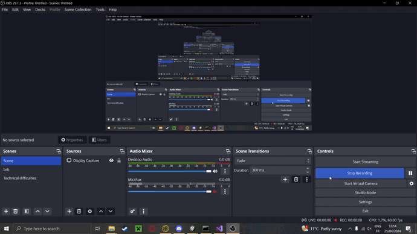

# TP Morpion 3D

On a réalisé un jeu de Morpion, mais en 3D et à potentielement plus que 2 joueurs. Les joueurs jouent un jeton chacun leur tour. On ne peut pas viser le centre initialement, il faut d'abords qu'un joueur fasse un "trou" sur un bords en plaçant un jeton.

## 4 - Gagner

2. Pour détécter un alignement de 3 jetons et déterminer si le joueur à gagné. On a créé un algorithme qui permet de détecter si il y a un alignement dans les coups joués par le joueur.

Pour cela on créé une fonction qui va récupérer la position jouée.
Dans une fonction CheckWin on initialise à 0, les variables de toutes les lignes possibles (celle de la ligne horizontal, verticale, les diagonales de chaque cotés, les lignes et colonnes de profondeur et les diagonales en profondeur...) 
Ensuite pour chaque position jouée, on recherche sa position. 
Si une des positions contient un jeton on ajoute 1 à la variable Count de la ligne correspondante.
Une fois qu'on a checké toutes les lignes, on verifie si une des variables count est superieure à 3, si oui c'est une gagne.
Cette boucle tourne pour chaque position jouée.

